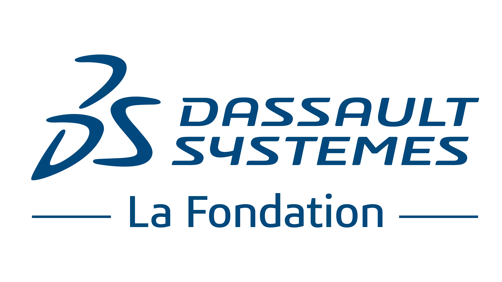

<h1 align="center">
    <picture>
        <source srcset="./media/images/tirtha-logo-dark.webp" media="(prefers-color-scheme: dark)">
        
        </picture>
    <!-- $\color{#ff4c40}{\textrm{Project Tirtha [Beta]}}$ -->
    Project Tirtha [Beta]
</h1>

<div align="center">
    <a href="https://www.niser.ac.in" target="_blank">
        <picture>
            <source srcset="./media/images/niser-logo-dark.webp" media="(prefers-color-scheme: dark)">
            
        </picture>
    </a>
    <a href="https://www.lafondation3ds.org/" target="_blank">
        <picture>
            <source srcset="./media/images/lfds-logo-dark.webp" media="(prefers-color-scheme: dark)">
            
        </picture>
    </a>
    <a href="https://odisha.gov.in/explore-odisha/state-archaeology" target="_blank">
        <picture>
            <source srcset="./media/images/odisha-logo-dark.webp" media="(prefers-color-scheme: dark)">
            
        </picture>
    </a>
</div>

---

[](https://signal.group/#CjQKIN_Ry9rBYUZJn8pLEkfWMAkZvO2FGopPalXsWPMZauXyEhBT1GdJYb5C_PJV0qE5VTLj) [](https://matrix.to/#/#tirtha:matrix.org) [](https://github.com/smlab-niser/tirtha-public/discussions)

---
[Project Tirtha](https://tirtha.niser.ac.in) is an *academic initiative* to create
3D models of heritage sites using crowdsourced images. The word *Tirtha* is Sanskrit
for "a place of pilgrimage", and is commonly used to refer to the sacred sites of
Hinduism. Our goal is to preserve and showcase the beauty and cultural significance
of heritage sites. We believe that by allowing the general public to contribute to
the creation of these models, and by providing open access to these models, we can
increase awareness and appreciation of these important cultural landmarks and inspire
future generations to maintain them for years to come.

This project is now open-source under the [GNU Affero General Public License v3.0](./LICENSE)
and is under active development. All contributions are welcome. Please read
[CONTRIBUTING.md](./CONTRIBUTING.md) for more details.

See [Citation](#citation) for information on how to cite this project. A [CITATION.cff](./CITATION.cff) file is also available in the repository.

## System Architecture

<picture>
    <source srcset="./media/images/architecture-dark.webp" media="(prefers-color-scheme: dark)">
    
</picture>

[See the paper](#citation) for more details.

## Requirements
### Hardware
* OS: Ubuntu 22.04 LTS (Other Linux distros may work, but are not tested)
* RAM: 16 GB+ for modest image sets (< 500 images)
* VRAM: 8 GB+; NVIDIA GPU required for CUDA support
* CPU: 16+ cores recommended
* Storage: 100 GB+ free space recommended

### Software
* `Python 3.11` (Developed using `Python 3.11.7`). To install on Ubuntu 22.04, run the following commands:
    ```sh
    sudo apt install python3.11 python3.11-venv python3.11-dev

    # NOTE: `python3.11-dev` is required by `psycopg2`. Swap the version number with your Python version as required.
    ```
* `Node.js` >= 18.0.0 & `npm` >= 8.0.0. To install these, you can use `nvm`:
    ```sh
    # Install nvm
    curl -o- https://raw.githubusercontent.com/nvm-sh/nvm/v0.39.7/install.sh | bash

    # Use nvm to install node & npm
    nvm install node
    nvm use node
    ```

## Deployment / Development Setup
* ***Dockerfile to be updated***.

### Manual Setup
1. Clone the repository and `cd` to it.
    ```sh
    git clone https://github.com/smlab-niser/tirtha-public.git
    git submodule update --init --recursive  # To obtain the nn_models code & checkpoints
    cd tirtha-public
    ```
2. Install the required system packages using `apt`.
    ```sh
    sudo apt install postgresql postgresql-contrib nginx rabbitmq-server libpq-dev
    ```
3. Configure PostgreSQL:
    - Open the interactive PostgreSQL shell:
        ```sh
        sudo -u postgres psql
        ```
    - Once the psql shell opens, run the following commands. NOTE: These values will be used in `local_settings.py`.
        ```sql
        CREATE DATABASE <your_db_name>;
        CREATE USER <your_db_user> WITH PASSWORD '<your_db_pwd>';
        ALTER ROLE <your_db_user> SET client_encoding TO 'utf8';
        ALTER ROLE <your_db_user> SET default_transaction_isolation TO 'read committed';
        ALTER ROLE <your_db_user> SET timezone TO 'UTC';
        GRANT ALL PRIVILEGES ON DATABASE <your_db_name> TO <your_db_user>;
        ```
4. Configure Nginx:
    - Edit the Nginx configuration file available at `/etc/nginx/nginx.conf` - add `client_max_body_size 2G;` to the `http` block:
        ```sh
        sudo nano /etc/nginx/nginx.conf  # or use your preferred editor

        # Add the following line to the `http` block:
        client_max_body_size 2G;

        # Save the file and exit.
        ```
    - Edit the Tirtha configuration file available at `./tirtha_bk/config/tirtha.nginx` to suit your requirements. NOTE: Look for `# CHANGEME:` in the file.
    - Copy the edited file to the Nginx `sites-available` directory and symlink it to `sites-enabled`:
        ```sh
        sudo cp ./tirtha_bk/config/tirtha.nginx /etc/nginx/sites-available/tirtha
        sudo ln -s /etc/nginx/sites-available/tirtha /etc/nginx/sites-enabled/
        ```
5. Configure RabbitMQ:
    ```sh
    # Initial setup
    sudo systemctl enable rabbitmq-server  # For auto start on boot
    sudo systemctl start rabbitmq-server
    sudo rabbitmq-plugins enable rabbitmq_management  # Accessible at http://localhost:15672/#/

    # Add user, vhost and permissions
    # NOTE: Same to be used in `local_settings.py`
    sudo rabbitmqctl add_user <your_rmq_user> <your_rmq_pwd>
    sudo rabbitmqctl add_vhost <your_rmq_vhost>
    sudo rabbitmqctl set_user_tags <your_rmq_user> administrator
    sudo rabbitmqctl set_permissions -p <your_rmq_vhost> <your_rmq_user> ".*" ".*" ".*"  # For `<your_rmq_vhost>`

    # Check current consumer timeout
    sudo rabbitmqctl eval 'application:get_env(rabbit, consumer_timeout).'

    # Set consumer timeout to 1 year (= 31556952000 ms)
    # To avoid the `ConnectionResetError: [Errno 104] Connection reset by peer` error.
    echo "consumer_timeout = 31556952000" | sudo tee -a /etc/rabbitmq/rabbitmq.conf
    sudo systemctl restart rabbitmq-server
    ```
6. Create a Python virtual environment, activate it & upgrade some dependencies.
    ```sh
    python3.11 -m venv venv
    source ./venv/bin/activate
    pip install --upgrade pip setuptools wheel
    ```
7. Install the Python requirements via `pip`. NOTE: `protobuf==3.20.3` is required by `nsfw_model`.
    ```sh
    pip install -r ./requirements.txt
    pip install -e ./nn_models/nsfw_model
    pip install protobuf==3.20.3  # NOTE: Required by nsfw_model
    ```
8. Install the [Meshroom 2021.1.0](https://github.com/alicevision/Meshroom/releases/tag/v2021.1.0) binaries & libraries, after downloading it from [here](https://tirtha.niser.ac.in/static/artifacts/MR2021.1.0.zip) (**hosted by us**).
    ```sh
    # MR2021.1.0.zip contains the required Meshroom 2021.1.0 binaries & libraries in one zipped archive.
    wget https://tirtha.niser.ac.in/static/artifacts/MR2021.1.0.zip

    # Extract the binaries & libraries and place them in the `bin21` directory.
    unzip MR2021.1.0.zip
    mv bin21/ tirtha_bk/bin21/
    rm MR2021.1.0.zip  # Clean up

    # NOTE: We will upgrade to Meshroom 2023.x.x soon.
    ```
9. Download the checkpoint for MANIQA from [here](https://tirtha.niser.ac.in/static/artifacts/ckpt_kadid10k.pt) (**hosted by us**) and place it in `./nn_models/MANIQA/`.
    ```sh
    # Checkpoint hosted by us
    wget https://tirtha.niser.ac.in/static/artifacts/ckpt_kadid10k.pt

    # Place the checkpoint in the MANIQA submodule
    mv ckpt_kadid10k.pt ./nn_models/MANIQA/
    ```
10. The final root directory (`tirtha-public`) structure should look like this:
    ```sh
    tirtha-public
    ├── venv
    ├── <other_files_&_dirs>
    └── tirtha_bk
        ├── config
        ├── static
        ├── tirtha
        └── tirtha_bk
            ├── gunicorn
            ├── gunicorn.conf.py  # <-- Edited & renamed config file
            └── gunicorn.env
        └── gunicorn
            ├── local_settings.py  # <-- Edited & renamed config file
        └── bin21  # <-- Meshroom binaries & libraries
            ├── <aliceVision_* binaries>
            ├── <lib*.so* libraries>
            ├── cameraSensors.db
            └── vlfeat_K80L3.SIFT.tree
        └── nn_models  # <-- Submodules / NN models
            ├── __init__.py
            └── MANIQA
                └── ckpt_kadid10k.pt  # <-- Weights for MANIQA placed here
            └── nsfw_model
    ```
11. Install [`obj2gltf`](https://github.com/CesiumGS/obj2gltf) & [`gltfpack`](https://github.com/zeux/meshoptimizer/):
    ```sh
    # obj2gltf
    npm install -g obj2gltf # NOTE: Ensure node>=18.0.0 & npm>=8.0.0 are installed

    # gltfpack - NOTE: Do not install via npm
    wget https://github.com/zeux/meshoptimizer/releases/download/v0.20/gltfpack-ubuntu.zip
    unzip gltfpack-ubuntu.zip
    chmod +x gltfpack
    sudo mv gltfpack /usr/local/bin/
    rm gltfpack-ubuntu.zip  # Clean up
    ```
12. Rename `local_settings.example.py` to `local_settings.py` and edit it as required. NOTE: Look for `# CHANGEME:` in the file.
    - Change the `SECRET_KEY` in `local_settings.py`. You can generate a new key using `python -c 'from django.core.management.utils import get_random_secret_key; print(get_random_secret_key())'`.
    - Create directories for logging, archiving (backups etc.), and production (static and media folders) somewhere on the system. For example, in `/var/www/tirtha/`, like so:
        ```sh
        sudo mkdir /var/www/tirtha
        sudo mkdir /var/www/tirtha/prod
        sudo mkdir /var/www/tirtha/prod/logs
        sudo mkdir /var/www/tirtha/prod/static
        sudo mkdir /var/www/tirtha/prod/media
        sudo mkdir /var/www/tirtha/archive
        sudo mkdir /var/www/tirtha/archive/archives
        sudo mkdir /var/www/tirtha/archive/db_backups

        # Change permission & ownership of the directories to the system user
        sudo chmod -R 755 /var/www/tirtha/
        sudo chown -R <user>:<user> /var/www/tirtha/

        # NOTE: Replace <user> with the user running the system. You can find this out using `whoami`.
        ```
    - After running the above commands, the directory structure should look like the following. Use these to fill in the required values in `local_settings.py`.
        ```sh
        /var/www/tirtha/ # Example data directory
        ├── archive
        │   ├── archives
        │   └── db_backups
        └── prod
            ├── logs
            ├── media
            └── static
        ```
    - Besides the file and folder paths, you will need to add the database credentials, RabbitMQ credentials, etc. in `local_settings.py`. Use the values from the previous steps.
    - To set up "Sign in with Google", you will need a `GOOGLE_CLIENT_ID`. See [here](https://developers.google.com/identity/gsi/web/guides/overview) for more details. Or, comment out the associated code to disable this feature.
    - To associate each mesh produced by the pipeline with a permanent ARK identifier, you will need to set up an ARK NAAN (Name Assigning Authority Number) and a resolver. See [here](https://arks.org/) for more details. Or, comment out the associated code to disable this feature.
13. Rename `gunicorn.conf.example.py` to `gunicorn.conf.py` and edit it as required. NOTE: Look for `# CHANGEME:` in the file.
14. After making the directories, editing the configuration files and renamimg/moving files, you can connect the database to Django.
    - Migrate the database:
        ```sh
        # NOTE: cd to `tirtha-public/tirtha_bk` first
        # NOTE: Ensure that local_settings.py is configured correctly.
        python manage.py makemigrations
        python manage.py migrate
        ```
    - Create a superuser (to access the Django Admin Panel):
        ```sh
        python manage.py createsuperuser
        ```
    - Collect the static files:
        ```sh
        python manage.py collectstatic
        ```
15. If you are using a firewall (`ufw`), you will need to allow Nginx, and open (some) port(s):
    ```sh
    # Check if ufw is enabled
    sudo ufw status

    # If it is enabled, run the following:
    sudo ufw allow 'Nginx Full'
    sudo ufw allow 15672  # For RabbitMQ
    ```
16. Test run Tirtha.
    - Run the server using `manage.py` or `gunicorn`.
        ```sh
        python manage.py runserver

        # OR

        gunicorn --bind localhost:8000 tirtha_bk.wsgi
        ```
    - Open `localhost:8000` in your browser to view the website. NOTE: Static files may not load correctly in development mode (`DEBUG = True` in `local_settings.py`).
    - To access the admin panel using the superuser credentials created above, browse to `localhost:8000/admin`.
17. Set up the Celery worker for managing uploads and pipeline runs. NOTE: Do this in a separate terminal window or preferably, a separate `tmux` session.
    ```sh
    # NOTE: cd to `tirtha-public/tirtha_bk` first
    celery -A tirtha worker -l INFO --max-tasks-per-child=1 -P threads --beat
    ```
    Here, `--max-tasks-per-child=1` helps avoid high memory consumption; `--beat` is used to start the beat scheduler; and `-P threads` forces celery to use threads instead of processes, in order to avoid conflicts with `multiprocessing`. You can also use the `-D` flag to run the worker in the background. For logging, you can use the `-f` flag to specify a log file. See `celery worker --help` for more details.
18. To set up systemd socket and service for Tirtha, follow the instructions [here](https://www.digitalocean.com/community/tutorials/how-to-set-up-django-with-postgres-nginx-and-gunicorn-on-ubuntu-22-04#creating-systemd-socket-and-service-files-for-gunicorn).


## Citation
Please cite the following paper if you use this software in your work ([arXiv](https://arxiv.org/abs/2308.01246) | [Papers with Code](https://paperswithcode.com/paper/tirtha-an-automated-platform-to-crowdsource) | [ACM Digital Library](https://dl.acm.org/doi/10.1145/3611314.3615904)):
```bibtex
@inproceedings{10.1145/3611314.3615904,
    author = {Shivottam, Jyotirmaya and Mishra, Subhankar},
    title = {Tirtha - An Automated Platform to Crowdsource Images and Create 3D Models of Heritage Sites},
    year = {2023},
    isbn = {9798400703249},
    publisher = {Association for Computing Machinery},
    address = {New York, NY, USA},
    url = {https://doi.org/10.1145/3611314.3615904},
    doi = {10.1145/3611314.3615904},
    abstract = {Digital preservation of Cultural Heritage (CH) sites is crucial to protect them against damage from natural disasters or human activities. Creating 3D models of CH sites has become a popular method of digital preservation thanks to advancements in computer vision and photogrammetry. However, the process is time-consuming, expensive, and typically requires specialized equipment and expertise, posing challenges in resource-limited developing countries. Additionally, the lack of an open repository for 3D models hinders research and public engagement with their heritage. To address these issues, we propose Tirtha, a web platform for crowdsourcing images of CH sites and creating their 3D models. Tirtha utilizes state-of-the-art Structure from Motion (SfM) and Multi-View Stereo (MVS) techniques. It is modular, extensible and cost-effective, allowing for the incorporation of new techniques as photogrammetry advances. Tirtha is accessible through a web interface at https://tirtha.niser.ac.in and can be deployed on-premise or in a cloud environment. In our case studies, we demonstrate the pipeline’s effectiveness by creating 3D models of temples in Odisha, India, using crowdsourced images. These models are available for viewing, interaction, and download on the Tirtha website. Our work aims to provide a dataset of crowdsourced images and 3D reconstructions for research in computer vision, heritage conservation, and related domains. Overall, Tirtha is a step towards democratizing digital preservation, primarily in resource-limited developing countries.},
    booktitle = {Proceedings of the 28th International ACM Conference on 3D Web Technology},
    articleno = {11},
    numpages = {15},
    keywords = {photogrammetry, open source, digital heritage, crowdsourcing, 3D dataset},
    location = {San Sebastian, Spain},
    series = {Web3D '23}
}
```
You can also use GitHub's citation feature to generate a citation for this repository. See [here](https://docs.github.com/en/repositories/managing-your-repositorys-settings-and-features/customizing-your-repository/about-citation-files) for more details.

## Funding & Acknowledgment
This project is funded by [La Fondation Dassault Systèmes](https://www.lafondation3ds.org/). We also thank the following individuals for their contributions to the project's development:
- [JeS24](https://github.com/JeS24)
- [annadapb](https://github.com/annadapb)

We are grateful to the developers of the following open-source libraries, which help make this project a reality:
- [AliceVision Meshroom](https://github.com/alicevision/Meshroom/), available under the [Mozilla Public License 2.0](https://github.com/alicevision/Meshroom/blob/develop/LICENSE-MPL2.md).
- [MANIQA](https://github.com/IIGROUP/MANIQA), available under the [Apache 2.0 License](https://github.com/IIGROUP/MANIQA/blob/master/LICENSE).
- [nsfw_model](https://github.com/GantMan/nsfw_model), available under the [MIT License](https://github.com/GantMan/nsfw_model/blob/master/LICENSE.md).
- [obj2gltf](https://github.com/CesiumGS/obj2gltf)
- [gltfpack](https://github.com/zeux/meshoptimizer)
- [model-viewer](https://github.com/google/model-viewer)
- [Google Fonts | Rubik](https://github.com/googlefonts/rubik)
- [Google Fonts | Material Icons](https://github.com/google/material-design-icons)
- [Django](https://github.com/django/django)
- [jQuery](https://github.com/jquery/jquery)
- [gunicorn](https://github.com/benoitc/gunicorn)
- [nginx](https://github.com/nginx/nginx)
- [Celery](https://github.com/celery/celery)
- [RabbitMQ](https://github.com/rabbitmq)
- [OpenCV](https://github.com/opencv/opencv)
- [Docker](https://github.com/docker)

We also thank Odisha State Archaeology for their support.

---

&copy; 2023-24 Project Tirtha,
[Subhankar Mishra's Lab](https://www.niser.ac.in/~smishra/),
[School of Computer Sciences](https://www.niser.ac.in/scps/), NISER.
All rights reserved.
